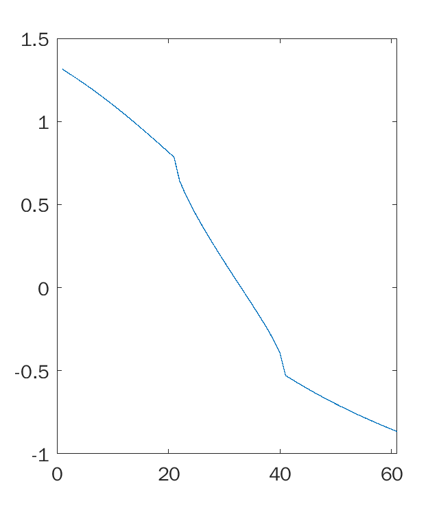

## Зачётная работа ##


| Выполнил | Группа |
| ------- | ----- |
| Долидзе Александра | Б18-514 |


#### Задание №1 ####
Построить график действительной части функции в декартовой системе координат (5 баллов)
Интервал изменения аргумента: [0.1, 1.8].
Шаг: 1/20 = 0.05

```tex
f(x) = \frac{arccos (\sqrt x)}2 - \frac {3arcsh(x)}5
```

Решение:
```matlab
x = 0.1:0.05:1.8
plot(real(acos(x.^0.5)/2 - 3*asinh(x)/5))
```

Ответ:


#### Задание №2 ####
Решить систему линейных уравнений (5 баллов)
Начальные приближение:
```tex
\begin{equation*}
 \begin{cases}
  x = -1 \\
  y = 2 \\
  z = 0
 \end{cases}
\end{equation*}
```
Задана система линейных уравнений:
```tex
\begin{equation*}
 \begin{cases}
  2x + 9y -4z = 0 \\
  2x -5y +3z = -1 \\
  x/3 + 6y -1/2z= 4
 \end{cases}
\end{equation*}
```
Решение:
```matlab
syms x y z
eq1= 2*x + 9*y -4*z ==0
eq2 =  2*x -5*y +3*z == -1
eq3 =  (1/3)*x +6*y -(1/2)*z == 4
solx, soly, solz] = vpasolve([eq1 eq2 eq3], [x y z], [-1; 2; 0])
```

Ответ:
```matlab
solx =

-0.70197044334975369458128078817734


soly =

0.83251231527093596059113300492611


solz =

1.5221674876847290640394088669951
```

#### Задание №3 ####
Найти пределы функций при
```tex
n \rightarrow \infty
```
(5 баллов)

```tex
\begin{enumerate}
  \item \lim_{n\rightarrow \infty}(\frac{(n+1)^3 - (n-1)^3}{(n+1)^2 - (n-1)^2})
  \item f= 1 + \frac 1 x
\end{enumerate}
```

1.
Решение:
```matlab
syms n
f = ((n+1)^3-(n-1)^3)/((n+1)^2-(n-1)^2)
limit(f, n, inf)
```

Ответ:
```matlab
ans =

Inf
```
2.
Решение:
```matlab
syms x
f = 1 + 1/x
limit(f, x, inf)
```

Ответ:
```matlab
ans =

1
```
#### Задание №4 ####
Продифференцировать функции (5 баллов)
```tex
\begin{enumerate}
  \item \frac {5sin(2x)} {cos(\sqrt{2x})}
  \item \tan(\ln x^{\frac 1 3})
\end{enumerate}
```
1.
Решение:
```matlab
syms x
f = 5*sin(2*x)/(cos(2*x)^(1/2))
diff(f)
```

Ответ:
```matlab
ans =

10*cos(2*x)^(1/2) + (5*sin(2*x)^2)/cos(2*x)^(3/2)
```
2.
Решение:
```matlab
syms x
f = tan(log(x)^(1/3))
diff(f)
```

Ответ:
```matlab
ans =

(tan(log(x)^(1/3))^2 + 1)/(3*x*log(x)^(2/3))
```
#### Задание №5 ####
Найти неопределенные интегралы функций (5 баллов)
```tex
\begin{enumerate}
  \item \frac {x} {x^2+1})}
  \item (2x-1)^{\frac 1 2}
\end{enumerate}
```
1.
Решение:
```matlab
syms x
f = x/(x^2+1)
int(f)
```

Ответ:
```matlab
ans =

log(x^2 + 1)/2
```
2.
Решение:
```matlab
syms x
f = (2*x - 1)^(1/2)
int(f)
```

Ответ:
```matlab
ans =

(2*x - 1)^(3/2)/3
```

Найти неопределенный интеграл функции z по переменным x и y:
```tex
z =  3(1-x)^2\cdot \exp(-x^2 - (y+1)^2)- 10(\frac x 5 - x^3 - y^5)\cdot \exp(-x^2-y^2)- \frac 1 3 \cdot \exp(-(x+1)^2 - y^2)```
Решение:
```matlab
syms x
z =  3*(1-x).^2.*exp(-(x.^2) - (y+1).^2) - 10*(x/5 - x.^3 - y.^5).*exp(-x.^2-y.^2) - 1/3*exp(-(x+1).^2 - y.^2)
int(int(z, y))
```

Ответ:
```matlab
ans =

exp(-x^2)*(pi^(1/2)*erfi(y*1i)*2i + (3*pi^(1/2)*erf(y + 1))/2) + (pi*erfi(x*1i + 1i)*erf(y)*1i)/12 + (pi^(1/2)*erfi(x*1i)*(10*exp(-y^2) - (9*pi^(1/2)*erf(y + 1))/4 + 10*y^2*exp(-y^2) + 5*y^4*exp(-y^2))*1i)/2 - (3*x*pi^(1/2)*erf(y + 1)*exp(-x^2))/4 - (5*x^2*pi^(1/2)*exp(-x^2)*erf(y))/2
```

#### Задание №6 ####
Найти разложение функций в ряд Тейлора (5 баллов)
```tex
\begin{enumerate}
  \item \exp(x), x = 3
  \item \sin(x), x = 3
  \item \cos(x), x = 3
  \item acot(x), x = 1
\end{enumerate}
```
1.
Решение:
```matlab
syms x
taylor(exp(x), x, 'ExpansionPoint', 3)
```

Ответ:
```matlab
ans =

exp(3) + exp(3)*(x - 3) + (exp(3)*(x - 3)^2)/2 + (exp(3)*(x - 3)^3)/6 + (exp(3)*(x - 3)^4)/24 + (exp(3)*(x - 3)^5)/120
```

2.
Решение:
```matlab
syms x
taylor(sin(x), x, 'ExpansionPoint', 3)
```

Ответ:
```matlab
ans =

sin(3) - (sin(3)*(x - 3)^2)/2 + (sin(3)*(x - 3)^4)/24 + cos(3)*(x - 3) - (cos(3)*(x - 3)^3)/6 + (cos(3)*(x - 3)^5)/120
```

3.
Решение:
```matlab
syms x
taylor(cos(x), x, 'ExpansionPoint', 3)
```

Ответ:
```matlab
ans =

cos(3) + (sin(3)*(x - 3)^3)/6 - (sin(3)*(x - 3)^5)/120 - sin(3)*(x - 3) - (cos(3)*(x - 3)^2)/2 + (cos(3)*(x - 3)^4)/24
```

4.
Решение:
```matlab
syms x
taylor(acot(x), x, 'ExpansionPoint', 1)
```

Ответ:
```matlab
ans =

pi/4 - x/2 + (x - 1)^2/4 - (x - 1)^3/12 + (x - 1)^5/40 + 1/2
```
Найти первые 5 коэффициентов разложения Тейлора функции ctg(x) в точке x=1
Решение:
```matlab
syms x
taylor(cot(x), x, 'ExpansionPoint', 1, 'Order', 5)
```

Ответ:
```matlab
ans =

cot(1) - (cot(1)^2 + 1)*(x - 1) + ((2*cot(1))/3 + cot(1)*(cot(1)^2 + 1/3))*(x - 1)^2 + (x - 1)^4*((14*cot(1))/45 + cot(1)*(cot(1)^2/3 + cot(1)*(cot(1)/3 + cot(1)*(cot(1)^2 + 1/3)) + 2/15) + (2*cot(1)*(cot(1)^2 + 1/3))/3) - (x - 1)^3*((2*cot(1)^2)/3 + cot(1)*(cot(1)/3 + cot(1)*(cot(1)^2 + 1/3)) + 1/3)
```
#### Задание №7 ####
Найти все корни и построить график:
```tex
{\frac 1 n}^x = \log_{\frac 1 n}x, n = 16
```

Решение:
```matlab
syms x
n = 16
f = (1/n)^x == log(x)/log(1/n)
ran = 0+0.6 .*rand(5,1)
ran = sort(ran)
for i=1:6
  vpasolve(f,x, [ran(i,1) ran(i+1,1)])
end
```
Ответ:
```matlab
ans =
0.50000000000000029659902607769566

ans =
0.3642498897836479626866777599354

ans =
0.25000000000000029659902607769791
```
