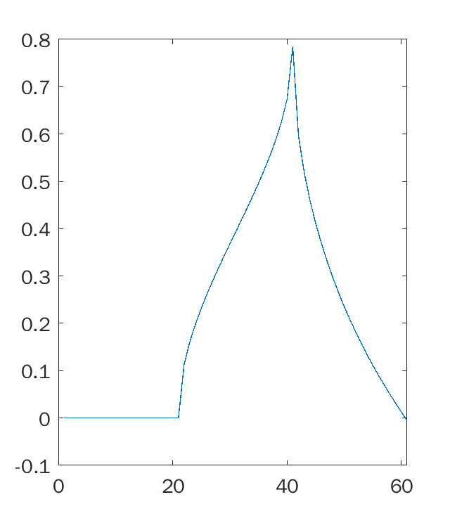
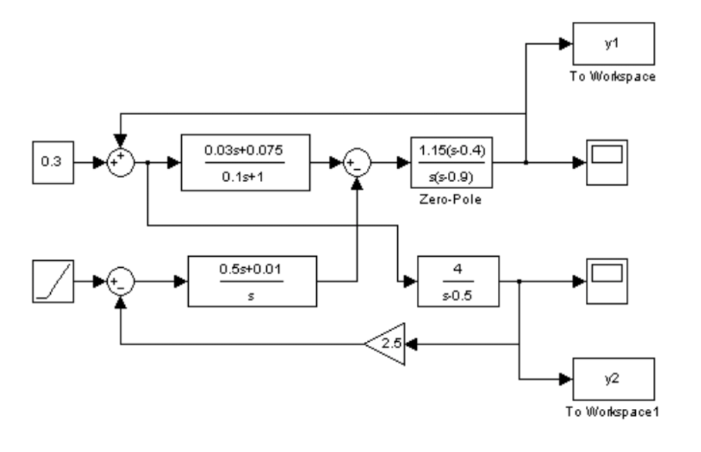

## Контрольная работа №1 ##


| Вариант | Выполнил | Группа |
| -------- | ------- | ----- |
| ***test number*** | Долидзе Александра | Б18-514 |

#### Задание №1 ####
Построить график действительной части функции в декартовой системе координат
```math
f(x) = \frac{arcsin (\sqrt x)}2 - \frac {3arcch(x)}5
```

Решение:
```matlab
x = -1.0:0.05:2.0;
plot(real(asin(x.^0.5)/2 - 3*acosh(x)/5))
```
Ответ:



#### Задание №2 ####
Решить систему линейных уравнений
```math
\begin{equation*}
 \begin{cases}
   7x+5y-2z = 5 \\
   y - 2z = 7 \\
   5x+3y+3z = -1
 \end{cases}
\end{equation*}
```
Решение:
```matlab
x = [7, 5, -2; 0, 1, -2; 5, 3, 3];
b = [5; 7; -1];
linsolve(x, b);
```

Ответ:
```matlab
ans =

   -4.0870
    6.6522
   -0.1739
```

#### Задание №3 ####
Найти предел функции при
$`x \rightarrow \infty `$
$`f(x) = (1 + \frac 2 x)^x`$

Решение:
```matlab
syms x;
f = (1+2/x)^x;
limit(f, x, inf);
```
Ответ:
```matlab
ans =

exp(2)
```

#### Задание №4 ####
Продифференцировать функцию
```tex
\exp(\exp(x))^2 - \frac 1 x
```

Решение:
```matlab
syms x
f = exp(exp(x))^2 - 1/x
diff(f)
```
Ответ:
```matlab
ans =

1/x^2 + 2*exp(2*exp(x))*exp(x)
```

#### Задание №5 ####
Найти неопределенный интеграл функции по переменной x
```tex
f(x) = sin(x)*cos(x)*x
```
Решение:
```matlab
syms x
f = sin(x)*cos(x)*x
int(f)
```
Ответ:
```matlab
ans =

sin(2*x)/8 + (x*(2*sin(x)^2 - 1))/4
```

#### Задание №6 ####
Найти разложение в ряд Тейлора
```tex
\exp(x), x = 3
```
Решение:
```matlab
syms x
taylor(exp(x), x, 'ExpansionPoint', 3)
```
Ответ:
```matlab
ans =

exp(3) + exp(3)*(x - 3) + (exp(3)*(x - 3)^2)/2 + (exp(3)*(x - 3)^3)/6 + (exp(3)*(x - 3)^4)/24 + (exp(3)*(x - 3)^5)/120
```

#### Задание №7 ####
Найти все корни и построить график:
```tex
{\frac 1 n}^x = \log_{\frac 1 n}x, n = 16
```

Решение:
```matlab
syms x
n = 16
f = (1/n)^x == log(x)/log(1/n)
ran = 0+0.6 .*rand(5,1)
ran = sort(ran)
for i=1:6
  vpasolve(f,x, [ran(i,1) ran(i+1,1)])
end
```
Ответ:
```matlab
ans =
0.50000000000000029659902607769566

ans =
0.3642498897836479626866777599354

ans =
0.25000000000000029659902607769791
```

#### Задание №8 ####
Осуществить моделирование структуры, представленной на рисунке:
\\

Ответ:
