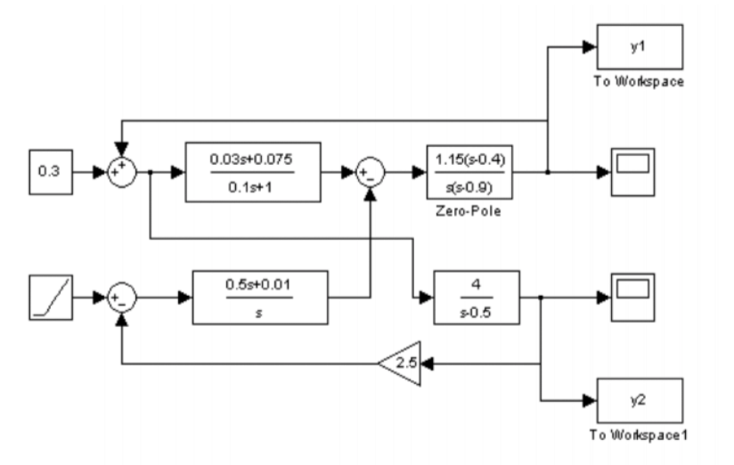

## Контрольная работа №1 ##


| Вариант | Выполнил | Группа |
| -------- | ------- | ----- |
| ***6*** | Долидзе Александра | Б18-514 |

#### Задание №1 ####
Построить график действительной части функции в декартовой системе координат
```math
f(x) = \frac{arctan (\sqrt x)}2 - \frac {3arcch(x)}5
```

Решение:
```matlab
x = -1.0:0.05:2.0
plot(real(atan(x.^0.5)/2 - 3*acosh(x)/5))
```

Ответ:


#### Задание №2 ####
Решить систему линейных уравнений
```math
\begin{equation*}
 \begin{cases}
   6x+y+4z = 6 \\
   -y + 2z = 3 \\
   7x+z = 3
 \end{cases}
\end{equation*}
```
Решение:
```matlab
x = [6, 1, 4; 0, -1, 2; 7, 0, 1];
b = [6; 3; 3];
linsolve(x, b);
```

Ответ:
```matlab
ans =

    0.2500
   -0.5000
    1.2500
```

#### Задание №3 ####
Найти предел функции при
$`x \rightarrow \infty `$
$`f(x) = (1 + \frac 1 x)^x`$

Решение:
```matlab
syms x;
f = (1+1/x)^x;
limit(f, x, inf);
```

Ответ:
```matlab
ans =

exp(1)
```

#### Задание №4 ####
Продифференцировать функцию
```tex
\frac {ctg(x)}{x^3} - \log{\log(x)}
```

Решение:
```matlab
syms x
f = diff(cot(x)/x^3 - log(log(x)))
diff(f)
```

Ответ:
```matlab
ans =
- (3*cot(x))/x^4 - 1/(x*log(x)) - (cot(x)^2 + 1)/x^3
```

#### Задание №5 ####
Найти неопределенный интеграл функции по переменной x
```tex
f(x) = sin(x)*cos(x)*x
```
Решение:
```matlab
syms x
f = sin(x)*cos(x)
int(f)
```

Ответ:
```matlab
ans = x^2/2
```

#### Задание №6 ####
Найти разложение в ряд Тейлора:
Найти первые 5 коэффициентов разложения Тейлора функции
```tex
ctg(x), x = 1
```
Решение:
```matlab
syms x
taylor(cot(x), x, ‘ExpansionPoint', 1, 'Order',5)
```

Ответ:
```matlab
ans =
cot(1) - (cot(1)^2 + 1)*(x - 1) + ((2*cot(1))/3 + cot(1)*(cot(1)^2 + 1/3))*(x - 1)^2 + (x - 1)^4*((14*cot(1))/45 + cot(1)*(cot(1)^2/3 + cot(1)*(cot(1)/3 + cot(1)*(cot(1)^2 + 1/3)) + 2/15) + (2*cot(1)*(cot(1)^2 + 1/3))/3) - (x - 1)^3*((2*cot(1)^2)/3 + cot(1)*(cot(1)/3 + cot(1)*(cot(1)^2 + 1/3)) + 1/3)
```

#### Задание №7 ####
Найти все корни и построить график:
```tex
{\frac 1 n}^x = \log_{\frac 1 n}x, n = 15.9
```

Решение:
```matlab
syms x
n = 15.9
f = (1/n)^x == log(x)/log(1/n)
ran = 0+0.6 .*rand(5,1)
ran = sort(ran)
for i=1:6
  vpasolve(f,x, [ran(i,1) ran(i+1,1)])
end
```
Ответ:
```matlab
ans =

0.4920166341507149304427776323114
ans =

0.25638501048070563587449537061289
ans =

0.36466434594514908454097654471475
```

#### Задание №8 ####
Осуществить моделирование структуры, представленной на рисунке:


Ответ:
